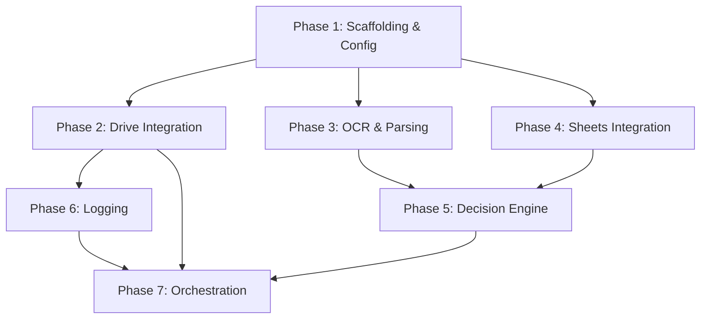

# 🧾 Dry Cleaning Automation — Implementation Plan

---

## 📌 Summary

Build a Python-based automation system that:
1. Watches a Google Drive folder for bill images
2. OCRs and parses bill data
3. Upserts orders & customers into a Google Sheet
4. Manages file lifecycle (`incoming → processing → processed/review/failed`)
5. Logs all outcomes to CSV files on Drive

---

## 🏗️ Tech Stack (FREE APIS & SERVICES ONLY)

| Layer              | Technology                              | Rationale                                          |
| ------------------ | --------------------------------------- | -------------------------------------------------- |
| Language           | Python 3.11+                            | Ecosystem fit, .gitignore already targets Python    |
| OCR                | Tesseract + `pytesseract`               | Free, open-source OCR; no billing account required  |
| Image Processing   | `Pillow` (PIL)                          | Pre-process images to improve Tesseract accuracy    |
| Drive Integration  | Google Drive API v3                     | Native folder operations, file move/list            |
| Sheets Integration | Google Sheets API v4                    | Read/write order & customer rows                    |
| Auth               | Google Service Account                  | Headless automation, no user login needed           |
| Scheduling         | `schedule` lib or cron                  | Periodic polling of incoming folder                 |
| Config             | `.env` + `python-dotenv`                | Secrets management                                  |
| Testing            | `pytest` + `pytest-mock`                | Unit & integration tests                            |
| Packaging          | `pyproject.toml` + `uv`                | Modern Python dependency management                 |

---

## 📂 Target Project Structure

```
drycleaning-bill-automation/
├── .ai/
│   └── plan.md                  ← this file
├── .env.example                 ← env var template (committed)
├── .env                         ← actual secrets (gitignored)
├── .gitignore
├── pyproject.toml               ← project metadata + dependencies
├── README.md
├── docs/
│   └── store-worker-runbook.md
├── app/
│   ├── __init__.py
│   ├── main.py                  ← entry point / scheduler loop
│   ├── config.py                ← settings & env loading
│   ├── drive/
│   │   ├── __init__.py
│   │   ├── client.py            ← Drive API wrapper
│   │   └── lifecycle.py         ← file move logic (incoming → processing → …)
│   ├── ocr/
│   │   ├── __init__.py
│   │   └── ocr_engine.py        ← Tesseract OCR wrapper + image preprocessing
│   ├── parser/
│   │   ├── __init__.py
│   │   └── bill_parser.py       ← extract structured fields from OCR text
│   ├── sheets/
│   │   ├── __init__.py
│   │   ├── client.py            ← Sheets API wrapper
│   │   ├── orders.py            ← Orders tab read/write
│   │   └── customers.py         ← Customers tab read/write
│   ├── engine/
│   │   ├── __init__.py
│   │   ├── processor.py         ← orchestrates the full pipeline per file
│   │   ├── decision.py          ← insert vs update, validation
│   │   └── customer_resolver.py ← find-or-create customer
│   └── logging/
│       ├── __init__.py
│       └── csv_logger.py        ← write to success/review/error logs
├── tests/
│   ├── __init__.py
│   ├── conftest.py              ← shared fixtures
│   ├── test_bill_parser.py
│   ├── test_decision.py
│   ├── test_customer_resolver.py
│   ├── test_processor.py
│   └── test_csv_logger.py
└── scripts/
    └── setup_drive_folders.py   ← one-time script to create Drive folder structure
```

---

## 🔀 Phases

### Phase 1 — Project Scaffolding & Config

> **Goal:** Runnable Python project with config, auth, and folder structure.

| #   | Task                                       | File(s)                                    |
| --- | ------------------------------------------ | ------------------------------------------ |
| 1.1 | Init `pyproject.toml` with dependencies    | `pyproject.toml`                           |
| 1.2 | Create `.env.example` with all config keys | `.env.example`                             |
| 1.3 | Implement `config.py` (load env vars)      | `app/config.py`                            |
| 1.4 | Set up project package structure           | `app/__init__.py`, all `__init__.py` files |
| 1.5 | Add service account auth helper            | `app/config.py`                            |

**Dependencies:**
```
google-api-python-client
google-auth
pytesseract
Pillow
python-dotenv
schedule
```

**System dependency (must be installed on host):**
```
# macOS
brew install tesseract

# Ubuntu/Debian
sudo apt-get install tesseract-ocr
```

**Config keys (`.env.example`):**
```env
GOOGLE_SERVICE_ACCOUNT_FILE=credentials.json
DRIVE_ROOT_FOLDER_ID=
SPREADSHEET_ID=
POLL_INTERVAL_SECONDS=60
```

**Acceptance criteria:**
- [ ] `python -m app.main` runs without import errors
- [ ] Config loads from `.env` correctly
- [ ] Service account credentials authenticate successfully

---

### Phase 2 — Google Drive Integration

> **Goal:** List, download, and move files between Drive folders.

| #   | Task                                                        | File(s)                 |
| --- | ----------------------------------------------------------- | ----------------------- |
| 2.1 | Implement Drive client (auth, list files, download, move)   | `app/drive/client.py`   |
| 2.2 | Implement folder ID resolution (find folders by name)       | `app/drive/client.py`   |
| 2.3 | Implement file lifecycle moves                              | `app/drive/lifecycle.py` |
| 2.4 | Create `scripts/setup_drive_folders.py` (one-time setup)    | `scripts/`              |

**Key methods — `DriveClient`:**
```python
class DriveClient:
    def list_files(self, folder_id: str) -> list[DriveFile]
    def download_file(self, file_id: str) -> bytes
    def move_file(self, file_id: str, from_folder: str, to_folder: str)
    def get_folder_id(self, folder_name: str, parent_id: str) -> str
```

**Key methods — `FileLifecycle`:**
```python
class FileLifecycle:
    def move_to_processing(self, file_id: str)
    def move_to_processed(self, file_id: str)
    def move_to_review(self, file_id: str)
    def move_to_failed(self, file_id: str)
```

**Acceptance criteria:**
- [ ] Can list files in `incoming/` folder
- [ ] Can download an image file as bytes
- [ ] Can move a file from `incoming/` to `processing/`
- [ ] Setup script creates all 6 folders if missing

---

### Phase 3 — OCR & Bill Parsing

> **Goal:** Extract structured bill data from an image.

| #   | Task                                                          | File(s)                      |
| --- | ------------------------------------------------------------- | ---------------------------- |
| 3.1 | Implement image preprocessing (grayscale, threshold, denoise) | `app/ocr/ocr_engine.py`      |
| 3.2 | Implement Tesseract OCR wrapper                               | `app/ocr/ocr_engine.py`      |
| 3.3 | Implement bill text parser (regex + heuristics)               | `app/parser/bill_parser.py`  |
| 3.4 | Write unit tests with sample OCR outputs                      | `tests/test_bill_parser.py`  |

**OCR wrapper (Tesseract):**
```python
class OCREngine:
    def preprocess_image(self, image_bytes: bytes) -> Image:
        """Grayscale → contrast enhance → threshold → denoise"""

    def extract_text(self, image_bytes: bytes) -> str:
        """Preprocess then run pytesseract.image_to_string()"""
```

**Image preprocessing pipeline** (critical for Tesseract accuracy):
1. Convert to grayscale
2. Increase contrast / sharpen
3. Apply adaptive thresholding (binarize)
4. Denoise (median filter)
5. Optional: deskew if rotated

**Bill template layout** (pre-printed "PICK MY LAUNDRY" template):
```
┌─────────────────────────────────────────────┐
│  PICK MY LAUNDRY                            │
│  No. ____        Date ___/___/___           │
│  Name ________   Delivery Date ___/___/___  │
│  (phone written below name, e.g. 9103200476)│
│─────────────────────────────────────────────│
│  S.No. │ Particulars │ Qty. │ Rate │ Amount │
│  1     │ Coat        │ 1    │ 200  │ 200    │
│  2     │ Wash & Iron │ 2.9kg│ 99   │ 288    │
│─────────────────────────────────────────────│
│  Total Pcs. ___    Total Amount ___         │
│  (Payment - Cash / Payment - UPI if paid)   │
│  (Advance: XXX if partial payment)          │
└─────────────────────────────────────────────┘
```

**Bill parser — target data model:**
```python
@dataclass
class ParsedBill:
    order_number: str | None       # From "No." field
    customer_name: str | None      # From "Name" field
    phone_number: str | None       # 10-digit number below name
    num_pieces: int | None         # From "Total Pcs." field
    num_pieces_kg: float | None    # Weight from Wash & Iron qty (e.g. 1.8kg)
    order_value: float | None      # From "Total Amount" (post-discount)
    order_date: str | None         # From "Date" field (DD/MM/YY on bill)
    delivery_date: str | None      # From "Delivery Date" field (DD/MM/YY on bill)
    payment_mode: str | None       # "Cash", "UPI", or None
    advance: float | None          # Partial payment amount if present
```

**Parsing rules:**
- `No. XXXX` → order number (near top of bill)
- `Name ______` → customer name
- 10-digit number (standalone, not the shop number `9971522720`) → phone number
- `Date DD/MM/YY` → order date (convert to `MM/DD/YY` for sheet)
- `Delivery Date DD/MM/YY` → delivery date (convert to `MM/DD/YY` for sheet)
- `Total Pcs. XX` → piece count
- `Total Amount XXX` → order value (post-discount)
- Wash & Iron qty with `kg` suffix (e.g. `1.8kg`, `2.9kg`) → num_pieces_kg
- `Payment - Cash` or `Payment - UPI` → payment method
- `Advance: XXX` or `Advance XXX` → advance amount
- **Ignore** individual line items (Coat, Jacket, etc.) — only extract totals

**Date conversion** (critical):
```python
# Bill: DD/MM/YY (Indian) → Sheet: MM/DD/YY
# Example: 9/4/26 → 04/09/26
```

**Acceptance criteria:**
- [ ] Image preprocessing improves OCR accuracy on sample bill photos
- [ ] OCR returns text from a test bill image
- [ ] Parser extracts all fields from clean OCR text
- [ ] Parser correctly converts dates from DD/MM/YY to MM/DD/YY
- [ ] Parser handles missing/partial fields gracefully (returns `None`)
- [ ] Parser ignores shop phone number `9971522720` when extracting customer phone
- [ ] Tests cover at least 5 bill variations (clean, messy, partial, payment-only, missing phone)

---

### Phase 4 — Google Sheets Integration

> **Goal:** Read and write orders & customers in the spreadsheet.

| #   | Task                                                          | File(s)                   |
| --- | ------------------------------------------------------------- | ------------------------- |
| 4.1 | Implement Sheets client (auth, read range, write/append)      | `app/sheets/client.py`    |
| 4.2 | Implement Orders tab operations (find, insert, update)        | `app/sheets/orders.py`    |
| 4.3 | Implement Customers tab operations (find by phone, insert)    | `app/sheets/customers.py` |

**Orders tab — actual 16-column layout:**
```
A: Order number    B: Customer Name   C: Number         D: Address
E: No of Pcs      F: No of Pcs / kg  G: In coming mode H: Order value
I: Order Date      J: Delivery Date   K: Delivery mode  L: Order Status
M: Payment mode    N: Comments        O: Advance        P: Default
```

| Column | Tool writes? | Source |
|--------|:---:|--------|
| A: Order number | ✅ | Bill `No.` field |
| B: Customer Name | ✅ | Bill `Name` field |
| C: Number | ✅ | Phone from bill |
| D: Address | ❌ | Manual (from Customers tab) |
| E: No of Pcs | ✅ | Bill `Total Pcs.` |
| F: No of Pcs / kg | ✅ | Wash & Iron qty (if applicable) |
| G: In coming mode | ❌ | Manual by worker |
| H: Order value | ✅ | Bill `Total Amount` (post-discount) |
| I: Order Date | ✅ | Bill `Date` (DD/MM/YY → MM/DD/YY) |
| J: Delivery Date | ✅ | Bill `Delivery Date` (DD/MM/YY → MM/DD/YY) |
| K: Delivery mode | ❌ | Manual by worker |
| L: Order Status | ✅ | `IN_PROGRESS` or `DELIVERED` |
| M: Payment mode | ✅ | `Pending`, `Cash`, or `UPI` |
| N: Comments | ❌ | Manual by owner/worker |
| O: Advance | ✅ | Bill `Advance: XXX` (if present) |
| P: Default | ❌ | Manual by owner/worker |

**Customers tab — actual 10-column layout:**
```
A: Name   B: Phone Number   C: Total Order Amount   D: Number of Orders
E: Last Order Date   F: First Order Date   G: Pending Payment
H: Package Balance   I: Locality   J: Address
```

| Column | Tool writes? | Notes |
|--------|:---:|-------|
| A: Name | ✅ | New customer only |
| B: Phone Number | ✅ | New customer only |
| C–J | ❌ | Manual / future formulas |

**Key methods — `OrdersSheet`:**
```python
class OrdersSheet:
    def find_by_order_number(self, order_number: str) -> tuple[OrderRow, int] | None
    def insert_order(self, order: OrderRow)
    def update_order(self, row_index: int, updates: dict)  # targeted cell updates only
```

**Key methods — `CustomersSheet`:**
```python
class CustomersSheet:
    def find_by_phone(self, phone: str) -> CustomerRow | None
    def insert_customer(self, name: str, phone: str)  # only Name + Phone
```

**Important:** Use targeted cell updates (A1 notation) rather than overwriting entire rows to avoid clobbering manually-entered data in columns the tool doesn't manage.

**Acceptance criteria:**
- [ ] Can read all rows from Orders tab (16 columns)
- [ ] Can find an order by order number (column A)
- [ ] Can append a new order row (only tool-managed columns)
- [ ] Can update specific cells in a row without touching manual columns
- [ ] Can find customer by phone in Customers tab (column B)
- [ ] Can insert new customer with Name + Phone only

---

### Phase 5 — Decision Engine & Business Logic

> **Goal:** Implement the core insert/update logic with all business rules.

| #   | Task                                                         | File(s)                          |
| --- | ------------------------------------------------------------ | -------------------------------- |
| 5.1 | Implement validation (required field checks)                 | `app/engine/decision.py`         |
| 5.2 | Implement insert vs update decision logic                    | `app/engine/decision.py`         |
| 5.3 | Implement update guards (never overwrite protected fields)   | `app/engine/decision.py`         |
| 5.4 | Implement customer resolver (find-or-create)                 | `app/engine/customer_resolver.py` |
| 5.5 | Write comprehensive unit tests                               | `tests/test_decision.py`, `tests/test_customer_resolver.py` |

**Validation rules:**
```python
class ValidationResult:
    is_valid: bool           # True if order_number AND phone_number present
    needs_review: bool       # True if some optional fields missing, or OCR couldn't read
    missing_fields: list[str]

def validate(bill: ParsedBill) -> ValidationResult
```

- **Failure** = Missing `order_number` OR `phone_number`
- **Review** = Has both required fields but missing optional fields, OR OCR couldn't read the bill

**Update guard rules (CRITICAL):**
```python
def safe_merge(existing: OrderRow, new: ParsedBill) -> dict:
    """
    Returns dict of {column: new_value} for targeted cell updates.
    
    - Never overwrite: order_number, phone_number, order_value
    - Payment mode: Pending → Cash/UPI ✅ | Cash/UPI → Pending ❌
    - Order Status: IN_PROGRESS → DELIVERED ✅ | DELIVERED → IN_PROGRESS ❌
    - Advance: update if new value present and existing is empty
    - Only update fields where new value is not None
    - Never touch manual columns (Address, In coming mode, Delivery mode, 
      Comments, Default)
    """
```

**New order insert defaults:**
```python
# When inserting a new order, set these defaults:
order_status = "IN_PROGRESS"
payment_mode = "Pending"
# Leave blank: Address, In coming mode, Delivery mode, Comments, Default
```

**Decision flow:**
```
ParsedBill → validate()
  ├─ FAIL (missing order_number or phone) → FailureOutcome
  ├─ REVIEW (partial data / OCR failure) → ReviewOutcome
  └─ VALID →
      ├─ find order by order_number
      │   ├─ NOT FOUND → InsertOutcome (new row, tool-managed columns only)
      │   └─ FOUND → safe_merge() → UpdateOutcome (targeted cell updates)
      └─ resolve customer (find-or-create by phone in Customers tab)
```

**Acceptance criteria:**
- [ ] Validation catches missing order number → failure
- [ ] Validation catches missing phone → failure
- [ ] OCR couldn't read bill → review (not failure)
- [ ] Existing order found → update (not insert)
- [ ] New order → insert with `IN_PROGRESS` + `Pending`
- [ ] Payment upgrade `Pending → Cash` works
- [ ] Payment downgrade `Cash → Pending` is blocked
- [ ] Status upgrade `IN_PROGRESS → DELIVERED` works
- [ ] Status downgrade `DELIVERED → IN_PROGRESS` is blocked
- [ ] Protected fields are never overwritten
- [ ] Manual columns (D, G, K, N, P) are never touched during updates
- [ ] Advance field is written if present on bill
- [ ] Customer created (Name + Phone only) if phone not found in Customers tab
- [ ] Customer not created if phone is missing

---

### Phase 6 — Logging & Observability

> **Goal:** Write structured CSV logs to Google Drive.

| #   | Task                                                    | File(s)                    |
| --- | ------------------------------------------------------- | -------------------------- |
| 6.1 | Implement CSV logger (append rows to Drive CSV files)   | `app/logging/csv_logger.py` |
| 6.2 | Write unit tests                                        | `tests/test_csv_logger.py`  |

**Log schemas:**

```python
# success_log.csv
SuccessLogEntry = {
    "timestamp": str,
    "file": str,
    "order": str,
    "action": str,           # "INSERT" or "UPDATE"
    "payment_mode": str,
    "order_status": str,
    "advance": str,
    "remarks": str,
}

# review_log.csv
ReviewLogEntry = {
    "timestamp": str,
    "file": str,
    "missing_fields": str,   # comma-separated
    "remarks": str,
}

# error_log.csv
ErrorLogEntry = {
    "timestamp": str,
    "file": str,
    "error_type": str,       # "VALIDATION", "OCR_FAILURE", "API_ERROR"
    "error_details": str,
}
```

**Implementation approach:**
- Download existing CSV from Drive → append row → re-upload (or use Drive append)
- Create CSV if it doesn't exist
- All timestamps in IST (`Asia/Kolkata`)

**Acceptance criteria:**
- [ ] Success log entry written after successful insert
- [ ] Review log entry written when file moves to review
- [ ] Error log entry written on failure
- [ ] CSV files are valid and parseable

---

### Phase 7 — Orchestration & End-to-End Integration

> **Goal:** Wire everything together into a polling loop.

| #   | Task                                                    | File(s)              |
| --- | ------------------------------------------------------- | -------------------- |
| 7.1 | Implement `Processor` (full pipeline per file)          | `app/engine/processor.py` |
| 7.2 | Implement `main.py` (polling loop + scheduling)         | `app/main.py`         |
| 7.3 | End-to-end integration test                             | `tests/test_processor.py` |
| 7.4 | Add console logging (structured, with log levels)       | `app/main.py`         |

**Processor pipeline (per file):**
```python
class Processor:
    def process_file(self, file: DriveFile) -> ProcessingOutcome:
        # 1. Move file: incoming → processing
        # 2. Download image bytes
        # 3. OCR → raw text
        # 4. Parse → ParsedBill
        # 5. Validate
        #    - If invalid → move to failed, log error, return
        #    - If needs review → move to review, log review, return
        # 6. Resolve customer (find-or-create)
        # 7. Decide: insert or update order
        # 8. Execute sheet write
        # 9. Move file: processing → processed
        # 10. Log success
        # 11. Return outcome
```

**Main loop:**
```python
def main():
    # Init all clients
    # Poll every POLL_INTERVAL_SECONDS:
    #   1. List files in incoming/
    #   2. For each file: processor.process_file(file)
    #   3. Handle unexpected exceptions gracefully (log + move to failed)
```

**Error handling strategy:**
- Each file processed independently — one failure doesn't block others
- Unexpected exceptions caught at top level → file moved to `failed/`, error logged
- API rate limits → exponential backoff with retry

**Acceptance criteria:**
- [ ] Full pipeline works end-to-end with a real bill image
- [ ] New order: image → parsed → inserted in sheet → file in `processed/`
- [ ] Payment update: second image → parsed → order updated → file in `processed/`
- [ ] Bad image: → file in `failed/`, error logged
- [ ] Partial data: → file in `review/`, review logged
- [ ] Polling loop runs continuously without crashing
- [ ] Graceful shutdown on `SIGINT`/`SIGTERM`

---

## 📊 Dependency Graph



**Parallelizable work:**
- Phase 2, 3, and 4 can be developed in parallel after Phase 1
- Phase 5 depends on 3 + 4
- Phase 6 depends on 2
- Phase 7 depends on all others

---

## ⚠️ Risks & Mitigations

| Risk                                          | Impact | Mitigation                                              |
| --------------------------------------------- | ------ | ------------------------------------------------------- |
| Tesseract OCR accuracy on handwriting is low  | High   | Image preprocessing + flexible parser; expect ~20-30% review rate |
| Tesseract not installed on host               | Medium | Document install steps; fail fast with clear error message        |
| Google API rate limits                         | Medium | Exponential backoff; batch reads where possible                   |
| Service account credential rotation           | Low    | Document refresh process; use short-lived tokens                  |
| Sheet schema changes break column assumptions | Medium | Use named ranges or header-based column lookup                    |
| Concurrent processing of same order number    | Low    | Process files sequentially within each poll cycle                 |

---

## 🔐 Security Notes

- Service account key (`credentials.json`) must **never** be committed
- `.env` is gitignored
- Share Drive folder + Sheet with service account email only
- Minimal API scopes:
  - `https://www.googleapis.com/auth/drive`
  - `https://www.googleapis.com/auth/spreadsheets`

---

## 💰 Cost Estimate

| Service              | Free Tier                     | Expected Usage  | Cost   |
| -------------------- | ----------------------------- | --------------- | ------ |
| Google Drive API     | 1B queries/day                | ~100/day        | ₹0     |
| Google Sheets API    | 300 requests/min              | ~50/day         | ₹0     |
| Tesseract OCR        | Fully free & open-source      | Unlimited       | ₹0     |
| Compute (local/VM)   | Local machine or free-tier VM | Always-on       | ₹0     |

**Total: ₹0** (fully free stack, no billing accounts required)

---

## 🏁 Definition of Done

- [ ] All 7 phases implemented and tested
- [ ] End-to-end flow works with real bill images
- [ ] Logs are written correctly to Drive CSVs
- [ ] File lifecycle works reliably
- [ ] Error handling covers all known edge cases
- [ ] Code is clean, typed, and documented
- [ ] README updated with setup & run instructions
